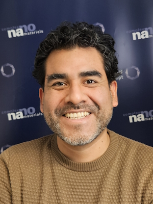

  

Leonardo Medrano Sandonas is a research associate at the Dresden University of Technology (TU Dresden) in Germany. He is currently working on combining machine learning methods with quantum/statistical mechanics to develop physics-inspired neural network potentials for the study of inorganic and organic materials. During his postdoc at the University of Luxembourg, he developed computational frameworks for investigating the dynamics of drug-protein systems as well as for data-driven molecular design. In 2018, Leonardo got his doctor degree in Mechanical Engineering at TU Dresden as an IMPRS fellow (International Max Planck Research School). Earlier, he got his bachelor and master’s degree in Physics at the National University of San Marcos in Lima-Peru. In addition to his theoretical investigations, Leonardo actively engages in multi-disciplinary projects with experimental/industrial collaborators to address current challenges in Physics and Chemistry (see Google Scholar page). He serves as a referee for numerous scientific journals and has also organized workshops and conferences in the past years.	
